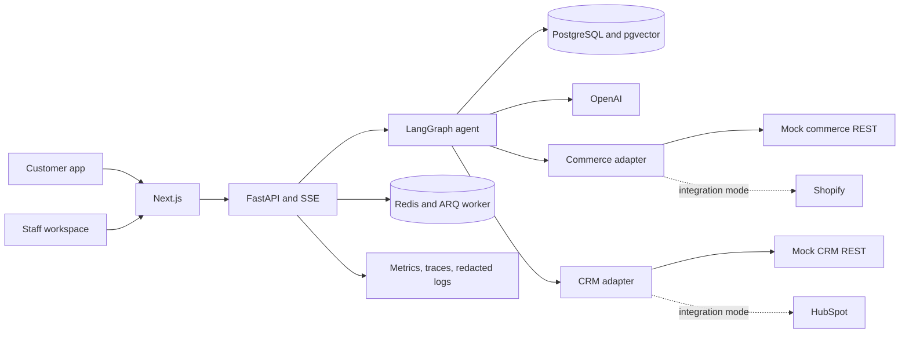
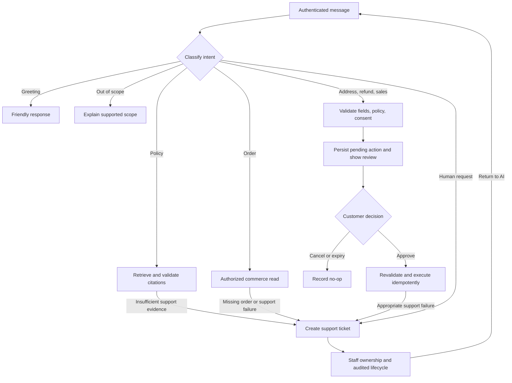

# AI Customer Support Agent — RAG, Tool Calling, CRM & Human Escalation

NovaCart helps customers get cited policy answers, track orders, and review account changes while giving support staff the context to take over when needed. It combines OpenAI, grounded retrieval, commerce and CRM tools, explicit write confirmations, and an audited human-support workspace.


All customers, orders, addresses, and screenshots are fictional. Portfolio mode uses OpenAI with persistent local mock commerce and CRM services. Shopify and HubSpot adapters are implemented and contract-tested; live vendor accounts have not been verified.

## Capabilities and workflows

| Customer self-service | Staff workspace |
| --- | --- |
| English/French policy answers with validated citations | Tickets grouped and searchable by customer |
| Order lookup and tracking from commerce records | Claim, public reply, private internal note |
| Address changes and refund requests with review cards | First reply can claim an unassigned ticket |
| Sales contact with consent and CRM confirmation | Separate Resolve, Close, and Return to AI actions |
| Human handoff with conversation context | Tenant-scoped analytics and sanitized audit timeline |
| Conversation search, suggested questions, AI loading feedback | Customer details and readable handoff summaries |

The dark interface uses mint accents and responsive mobile layouts. Reduced-motion preferences disable decorative animations. Greetings such as `hi` stay in AI mode. Unsupported general questions receive a scope explanation without automatically creating a ticket. Appropriate uncertain support cases, missing orders, and explicit human requests can escalate; an AI connection failure asks the customer to retry.

| Workflow | Behavior |
| --- | --- |
| FAQ | Retrieve tenant knowledge, generate an answer, validate citations, show sources. |
| Order lookup | Read the authenticated customer's order and tracking details. |
| Address update | Check eligibility, normalize fields, show review, revalidate and write after approval. |
| Refund | Evaluate policy and order facts, request missing details, confirm an eligible refund request. |
| CRM lead | Capture sales-contact consent, review the contact/lead, submit after approval. |
| Human handoff | Preserve context, create a ticket, pause AI while staff handles the case. |

Staff must own a ticket to work on it. In the UI, the first reply or private note claims an open, unassigned ticket before submitting content. Public replies reach the customer; private notes do not. **Resolve** marks the conversation and ticket resolved. **Close** uses a distinct closed status. **Return to AI**, available to the assigned staff member on in-progress or resolved cases, reopens the conversation in AI mode and leaves the ticket resolved. Closed tickets do not offer this transition. Conversation and resolved/closed ticket deletion uses soft deletion and authorization checks.

## Real implementation and simulated integrations

| Component | Portfolio configuration |
| --- | --- |
| OpenAI classification and grounded generation | Real API calls; your key is required |
| LangGraph routing, checkpoints, confirmations, recovery | Real |
| FastAPI, PostgreSQL/pgvector, Redis, SSE, audit | Real |
| Retrieval | Real pipeline with fake embeddings and deterministic reranking for a lightweight demo |
| Commerce and CRM | Functional persistent mock REST services with fictional data |
| Shopify and HubSpot | Selectable, contract-tested adapters; no live-account verification |
| Deterministic agent models | Tests and evaluations only; rejected outside test mode |

Production-like retrieval uses semantic embeddings and cross-encoder reranking. Screenshots demonstrate application workflows, not a benchmark of semantic retrieval or every model response.

## Architecture





These diagrams describe application control flow, not private model reasoning.

## Safeguards and operations

- **Write confirmation:** expiring action tokens bind approval to actor, action, and checkpoint. Revalidation, optimistic versions, and idempotency protect retries.
- **Multi-tenancy and RBAC:** authenticated organization/customer/staff scope, tenant-filtered queries, PostgreSQL RLS, and Support/Admin permissions.
- **Audit and privacy:** operational projections exclude private notes, raw provider payloads, credentials, and model reasoning. Session cookies and CSRF controls protect browser requests.
- **Webhooks:** signature/replay checks, bounded payloads, durable inbox deduplication, retries, dead-letter handling, reconciliation.
- **Cost controls:** actor/tenant rate and concurrency limits, step/time bounds, daily token/cost budgets, usage metrics. Configured estimates are not invoices.
- **Observability:** Prometheus, Grafana, OpenTelemetry, structured redacted logs, queue/provider metrics, runbooks.
- **Deployment:** TLS proxy, restricted database runtime role, mounted secrets, health checks, backup/restore procedures.

## Three operating configurations

### 1. Portfolio: OpenAI plus mock commerce and CRM

Requires Docker Desktop/Engine with Compose v2, Git, and an OpenAI key with available quota. The initial build downloads Python/model dependencies and can take several minutes.

**Windows PowerShell**

```powershell
git clone https://github.com/medalieli/ai-customer-support-agent.git
cd ai-customer-support-agent
Copy-Item .env.example .env
# Edit .env: replace NOVACART_OPENAI_API_KEY with your own key.
.\scripts\demo.ps1 start
# Open http://localhost:3000
```

**Bash: Linux, macOS, or Git Bash**

```bash
git clone https://github.com/medalieli/ai-customer-support-agent.git
cd ai-customer-support-agent
cp .env.example .env
# Edit .env: replace NOVACART_OPENAI_API_KEY with your own key.
bash scripts/demo.sh start
# Open http://localhost:3000
```

Required `.env` configuration (placeholders only):

```dotenv
NOVACART_OPENAI_API_KEY=replace-with-your-openai-project-api-key
NOVACART_AGENT_PROVIDER=openai
NOVACART_AGENT_MODEL=gpt-5-mini
COMMERCE_PROVIDER=mock
CRM_PROVIDER=mock
```

Keep the remaining fields from `.env.example`. The portfolio overlay selects local mocks and demo authentication. Keep `.env` private; never put the key in frontend code or commit it. OpenAI calls use your account quota.

Select a fictional customer on sign-in. **Demo-only staff credentials:** organization `novacart`, email `support@novacart.test`, password `synthetic-demo-password`. Use these only with fictional local data.

Stop with `.\scripts\demo.ps1 stop` or `bash scripts/demo.sh stop`. The `reset` action deletes the named `novacart-demo` project's fictional volumes and reseeds them; use it only to erase demo state.

For an isolated checkout test, `NOVACART_DEMO_PROJECT=novacart-demo-releasecheck` selects a separate Compose project. When using alternate ports, also update the API/frontend URLs and matching host-port variables; see the [verification record](docs/RELEASE_VERIFICATION.md).

### 2. Integration: OpenAI plus Shopify and/or HubSpot

Use the base configuration without `compose.demo.yaml`. Select `COMMERCE_PROVIDER=shopify` and/or `CRM_PROVIDER=hubspot` in the ignored `.env`, and supply `NOVACART_SHOPIFY_STORE_DOMAIN`, `NOVACART_SHOPIFY_ACCESS_TOKEN`, and/or `NOVACART_HUBSPOT_ACCESS_TOKEN`. Retain OpenAI configuration and configure paired internal keys for any provider still using mocks.

Missing selected-provider credentials are rejected; real adapters do not silently fall back to mocks. Capabilities differ: unsupported operations fail safely. Read the [architecture](docs/ARCHITECTURE.md) and [API contracts](docs/API.md) before connecting sandbox accounts. Live Shopify/HubSpot calls were not part of release verification.

### 3. Production-like deployment

Follow the [production operations guide](docs/PRODUCTION_OPERATIONS.md), `.env.production.example`, and `compose.production.yaml`. Provision private secrets, TLS, non-demo identity, a restricted runtime database role, semantic retrieval, and environment-specific origins/network settings. Optional observability overlays are included. This is a local deployment configuration, not a claim of cloud deployment or production readiness for an arbitrary client.

## Exact demo questions

Use fictional **Amira Haddad** unless indicated. Start a new conversation per scenario; cancel review cards to preserve seeded order state.

| Scenario | Exact message |
| --- | --- |
| Greeting | `hi` |
| Scope handling | `What is the capital of Japan?` |
| FAQ | `What is the NovaCart return policy?` |
| Tracking | `Track my order NC-1002` |
| Address | `Change shipping address NC-1001 immediately; recipient: Amira Haddad; line1: 10 Demo Street; city: Boston; region: MA; postal code: 02113; country code: US` |
| Refund | `Refund order NC-1004; reason: changed mind; SKU: MSE-PRO; quantity: 1; amount: USD 69.00` |
| Sales consent | `Book an enterprise product demo for Acme; interest: support API; need: scale customer care; contact: email. I consent to sales contact.` |
| Human handoff | `I need a human representative` |
| Final-sale refusal (Lucas Martin) | `Refund order NC-1006; reason: changed mind; SKU: CASE-RED; quantity: 1; amount: USD 19.00` |

`NC-9999` is deliberately nonexistent, used only for missing-order handling. See the [recording script](docs/portfolio/DEMO_SCRIPT.md) for the staff walkthrough.

## Screenshot gallery

| Order tracking | Human support workspace |
| --- | --- |
|  |  |

[View all eight screenshots](docs/portfolio/GALLERY.md), including address/refund review, CRM consent, analytics, and mobile support. Regenerate with `.\scripts\capture-portfolio.ps1`, a private OpenAI key, and fictional mock data.

## Testing and evaluation

The [release verification record](docs/RELEASE_VERIFICATION.md) records actual runs, coverage scope, browser results, security checks, and limitations. The older [M15 record](docs/M15_VERIFICATION.md) remains historical evidence.

```powershell
.\scripts\run-e2e.ps1 all
.\scripts\run-e2e.ps1 openai
.\scripts\capture-portfolio.ps1
```

```bash
cd backend
python -m pytest
ruff check .
ruff format --check .
mypy app tests
python -m app.evaluation --provider deterministic
cd ../frontend
npm test
npm run lint
npm run typecheck
npm run build
```

Backend database tests need the isolated database/provider environment configured by the runner; unit-only runs skip them and may not meet the combined coverage gate. Frontend coverage is scoped to `components/api-status.tsx`, not the whole UI. Browser suites exercise customer/staff behavior separately. Deterministic evaluations measure fixtures; real OpenAI results vary. The [evaluation plan](docs/EVALUATION_PLAN.md) explains datasets and metrics.

## Performance baseline

The **2026-09-06 local deterministic baseline** completed 102/102 mixed workflows at concurrency 1/4/8 with zero workflow errors. At concurrency 8: 0.754 workflows/s, HTTP P50/P95 2062/2872 ms, agent-run P50/P95 2501/2896 ms on a Ryzen 5 5600H host with Docker allocated 7.4 GiB RAM. See [methodology and results](docs/M15_VERIFICATION.md). This predates the current UI and OpenAI runtime changes; it is not OpenAI latency, a production SLA, or an internet-scale capacity result.

## Technology and structure

Python, FastAPI, LangGraph, OpenAI, SQLAlchemy, Alembic, PostgreSQL 17, pgvector, Redis/ARQ, Next.js 16, React 19, TypeScript, Docker Compose, Nginx, Prometheus, Grafana, OpenTelemetry, Pytest, Playwright, Vitest, Ruff, strict MyPy.

```text
backend/           API, agent, retrieval, tools, migrations, worker, tests
frontend/          Customer/staff interface and browser/unit tests
mock-commerce/     Persistent fictional commerce service
mock-crm/          Persistent fictional CRM service
deploy/            TLS proxy and database role setup
observability/     Dashboards, collector, metrics, alerts
performance/       Local load harness and baseline
scripts/           Demo, screenshots, tests, backup, deployment helpers
docs/              Architecture, operations, evidence, portfolio
.github/workflows/ CI and security/supply-chain checks
```

## Documentation

- [Case study](docs/portfolio/CASE_STUDY.md), [gallery](docs/portfolio/GALLERY.md), [demo script](docs/portfolio/DEMO_SCRIPT.md)
- [Architecture](docs/ARCHITECTURE.md), [HTTP API](docs/API.md), [evaluation](docs/EVALUATION_PLAN.md)
- [Observability](docs/OBSERVABILITY.md), [release verification](docs/RELEASE_VERIFICATION.md)
- [Production operations](docs/PRODUCTION_OPERATIONS.md), [historical verification](docs/M15_VERIFICATION.md)

## Limitations and client customizations

No live Shopify/HubSpot verification, cloud deployment, production traffic, production identity provider, or universal SLA is claimed. Mocks cover this project's contracts, not every vendor edge case. Portfolio retrieval is simplified; responses depend on OpenAI availability and vary. Self-signed local TLS does not demonstrate public CA trust or renewal. Coverage exclusions and measured scopes are documented.

Client adaptations could add SSO, verified sandbox integrations, branded multilingual knowledge, approval thresholds, help-desk migration, retention policies, expanded evaluations, and deployment through the client's security and operations process.

## Author

Built by [medalieli](https://github.com/medalieli).
