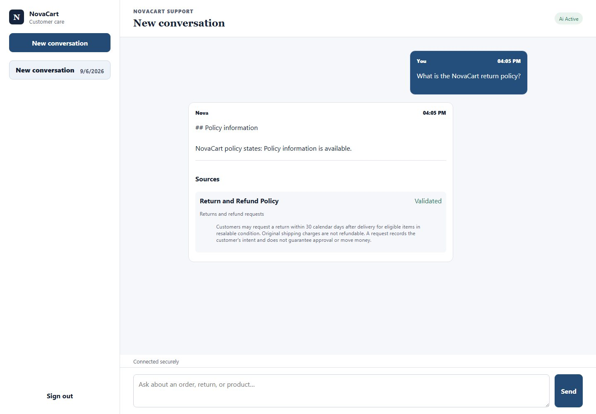
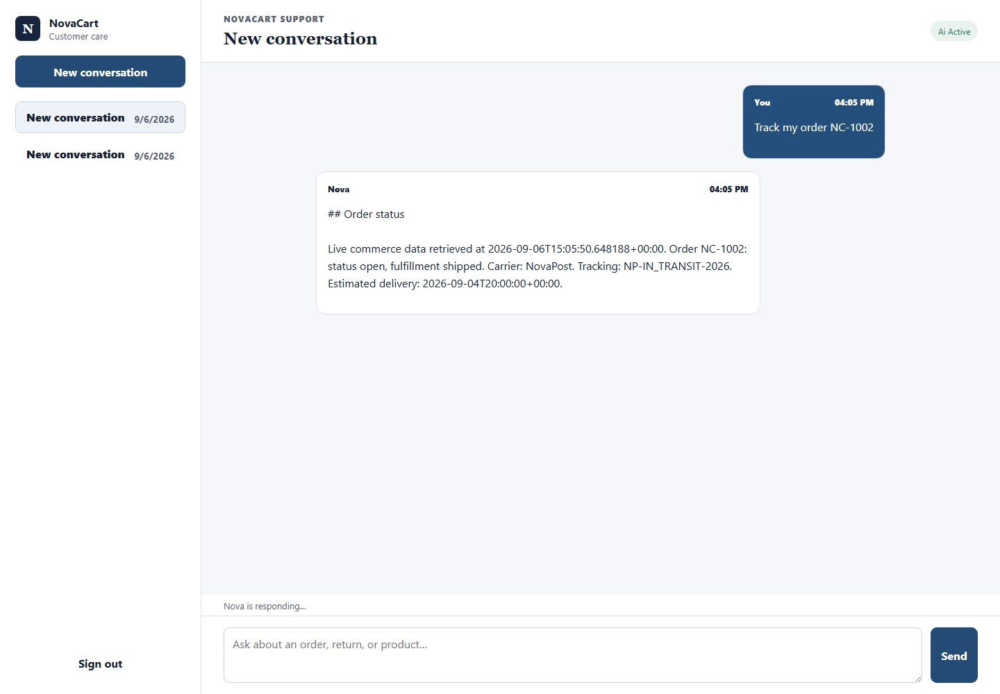
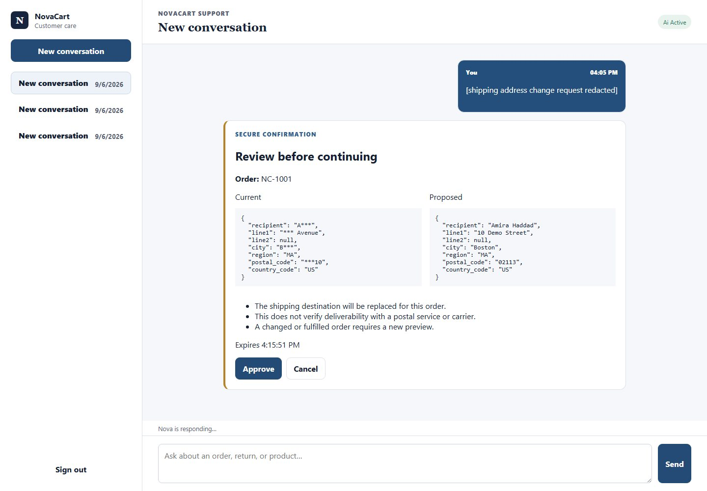
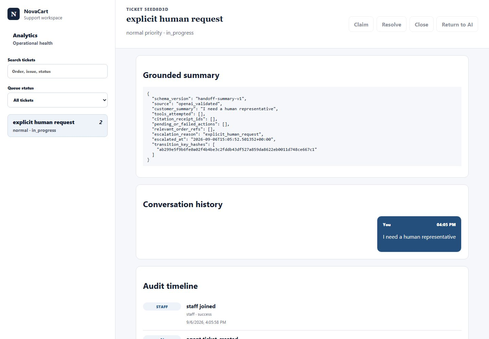
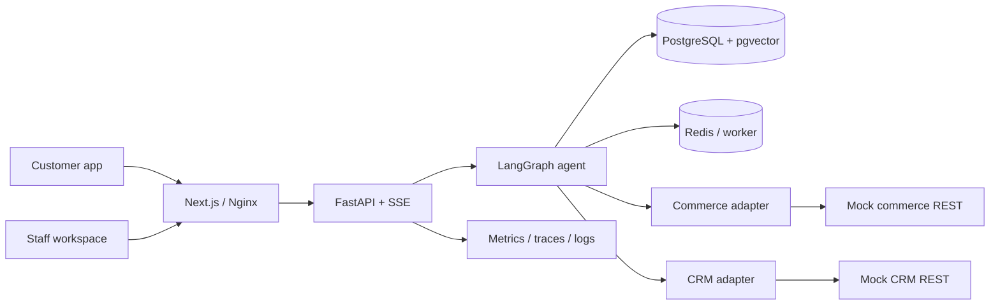
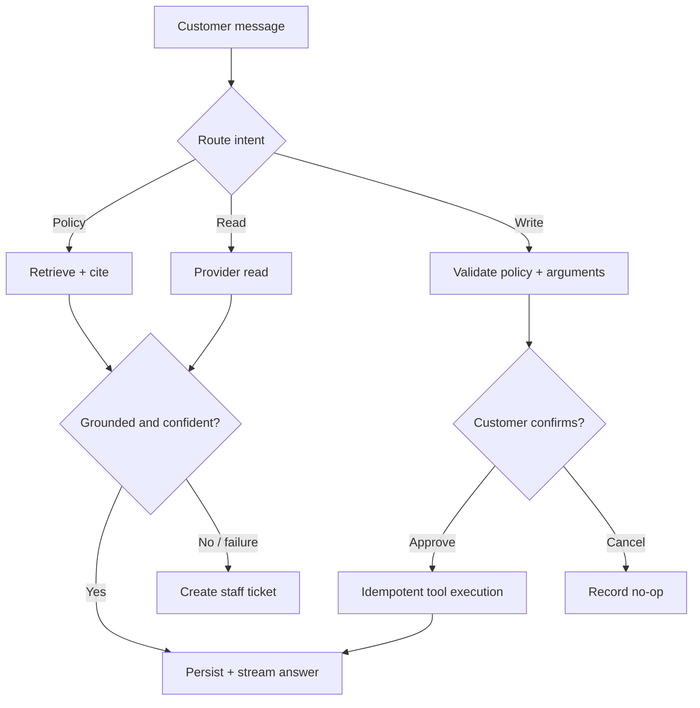

# AI Customer Support Agent — RAG, Tool Calling, CRM & Human Escalation

NovaCart is a portfolio-grade support system that answers policy questions with citations, reads and updates orders, evaluates refunds, captures consent before CRM actions, and transfers uncertain conversations to a staffed ticket workspace. It demonstrates useful automation while keeping consequential writes reviewable and auditable.

> All names, orders, customers, and screenshots are fictional. The repeatable demo uses internal mock commerce and CRM REST services—never live Shopify or HubSpot accounts.

## Business value

- Grounded, cited policy answers instead of unsupported guesses.
- Conversational access to current order and tracking data.
- Explicit confirmation for address, refund, and CRM writes.
- Safe escalation for low confidence, provider failures, and human requests.
- A staff queue for claim, reply, private notes, resolution, and return-to-AI.
- Auditable decisions with metrics, traces, evaluation, and security evidence.

| Customer workflows | Staff and operational workflows |
|---|---|
| FAQ/warranty, order tracking, address change, refund, sales consent | Ticket lifecycle, public/private replies, analytics, audit timeline |

## Screenshots

| Grounded FAQ | Order tracking |
|---|---|
| [](docs/portfolio/01-grounded-faq.jpg) | [](docs/portfolio/02-live-order-tracking.jpg) |
| **Confirmation before a write** | **Human handoff workspace** |
| [](docs/portfolio/03-address-confirmation.jpg) | [](docs/portfolio/06-human-handoff-staff.jpg) |

[Open the complete eight-image gallery](docs/portfolio/GALLERY.md), including refund, CRM consent, analytics, and mobile views.

## Real versus simulated

| Capability | Status |
|---|---|
| LangGraph routing, checkpoints, confirmations, recovery | Real |
| RAG, PostgreSQL, pgvector, Redis, FastAPI, SSE, tools | Real |
| OpenAI generation | Optional real integration; deterministic by default |
| Commerce and CRM | Functional persistent mock REST services |
| Shopify and HubSpot adapters | Contract-tested; not live-account verified |
| Production traffic/cloud deployment | Not claimed; measurements are local baselines |

## Architecture





These are control-flow diagrams, not private model reasoning. The [case study](docs/portfolio/CASE_STUDY.md) explains the design.

## Quick start

Prerequisites: Docker Desktop with Compose v2 and Git. The helper creates `.env` from placeholder-only `.env.example` if needed.

```powershell
# Windows PowerShell
.\scripts\demo.ps1 deterministic
# Open http://localhost:3000
.\scripts\demo.ps1 reset
.\scripts\demo.ps1 stop
```

```bash
# macOS, Linux, or Git Bash
./scripts/demo.sh deterministic
# Open http://localhost:3000
./scripts/demo.sh reset
./scripts/demo.sh stop
```

Demo-only staff login: `novacart` / `support@novacart.test` / `synthetic-demo-password`. Never reuse it outside this fictional local demo. `reset` recreates only the fictional volumes in the explicitly named `novacart-demo` Compose project; `clean` removes only that project’s resources. Exact prompts and IDs are in the [demo script](docs/portfolio/DEMO_SCRIPT.md).

## Modes

### Deterministic demo + mock providers

Use the quick start above. This explicitly uses the application’s `test` environment because deterministic generation is forbidden in development/production; retrieval, persistence, tools, confirmations, REST adapters, and SSE remain real.

### OpenAI generation + mock providers

```powershell
$env:NOVACART_OPENAI_API_KEY="<your-openai-project-key>"
.\scripts\demo.ps1 openai
```

```bash
export NOVACART_OPENAI_API_KEY='<your-openai-project-key>'
./scripts/demo.sh openai
```

The key stays in the shell. Commerce and CRM remain local mocks.

### Real integration mode

Copy `.env.example` to `.env`, replace placeholders with environment-specific secrets, choose `COMMERCE_PROVIDER=shopify` and/or `CRM_PROVIDER=hubspot`, and provide the corresponding credential fields. Startup rejects missing credentials. These adapters are contract-tested, not live-account verified.

### Production-like mode

The hardened TLS stack, mounted secrets, migration/runtime database roles, backup/restore, and runtime checks are in [production operations](docs/PRODUCTION_OPERATIONS.md). It supports internal mock providers. Demo credentials and `compose.demo.yaml` are not production configuration.

## Evidence

- **Tests:** backend/frontend/mock/integration/migration suites plus Ruff, strict MyPy, ESLint, TypeScript, and the production build run without lowered gates.
- **Evaluation:** deterministic grounded-answer, routing, confirmation, multilingual, provider-failure, and adversarial datasets are described in the [evaluation plan](docs/EVALUATION_PLAN.md).
- **Observability:** Prometheus, Grafana, structured redacted logs, OpenTelemetry, alerts, and runbooks are in [observability](docs/OBSERVABILITY.md).
- **Security:** startup guards, restricted-role RLS, TLS edge controls, scans, audits, and SBOM evidence are in [M15 verification](docs/M15_VERIFICATION.md).
- **Performance:** the checked-in local baseline completed 102 mixed workflows at concurrency 1/4/8 with zero workflow errors. Hardware, latency, SSE, controls, and Prometheus deltas are in [M15 verification](docs/M15_VERIFICATION.md); this is not a production SLA.

```powershell
.\scripts\run-e2e.ps1 all
.\scripts\run-load-test.ps1
docker compose -f compose.yaml -f compose.production.yaml config --quiet
```

```bash
cd backend && python -m pytest && ruff check . && mypy app
cd ../frontend && npm test -- --run && npm run lint && npm run typecheck && npm run build
```

## Technology

Python 3.12, FastAPI, LangGraph, SQLAlchemy, Alembic, PostgreSQL 17, pgvector, Redis/ARQ, Next.js, React, TypeScript, Playwright, Vitest, Docker Compose, Nginx, Prometheus, Grafana, OpenTelemetry, Ruff, MyPy, Bandit, Trivy, and GitHub Actions.

## Project structure

```text
backend/          API, graph, RAG, tools, migrations, worker, tests
frontend/         customer/staff Next.js UI and browser/unit tests
mock-commerce/    persistent fictional commerce REST service
mock-crm/         persistent fictional CRM REST service
observability/    dashboards, collector, metrics, alerts
deploy/           production proxy and database initialization
scripts/          demo, tests, load, backup, restore, TLS
docs/portfolio/   screenshots, case study, scripts, portfolio copy
.github/workflows CI and supply-chain checks
```

## Limitations and possible customizations

There is no live Shopify/HubSpot verification, cloud deployment, production traffic, or production identity provider. Mock services cover this project’s contracts, not every vendor edge case. OpenAI output varies and needs a user key; deterministic mode is the review baseline. Local performance is not internet-scale capacity.

Client work could replace mock credentials with sandboxed vendor integrations, add SSO, tailor multilingual policy content and branding, define approval thresholds, connect a preferred help desk, expand evaluations, and deploy through the client’s security process. Reusable summaries are in [portfolio copy](docs/portfolio/PORTFOLIO_COPY.md).
