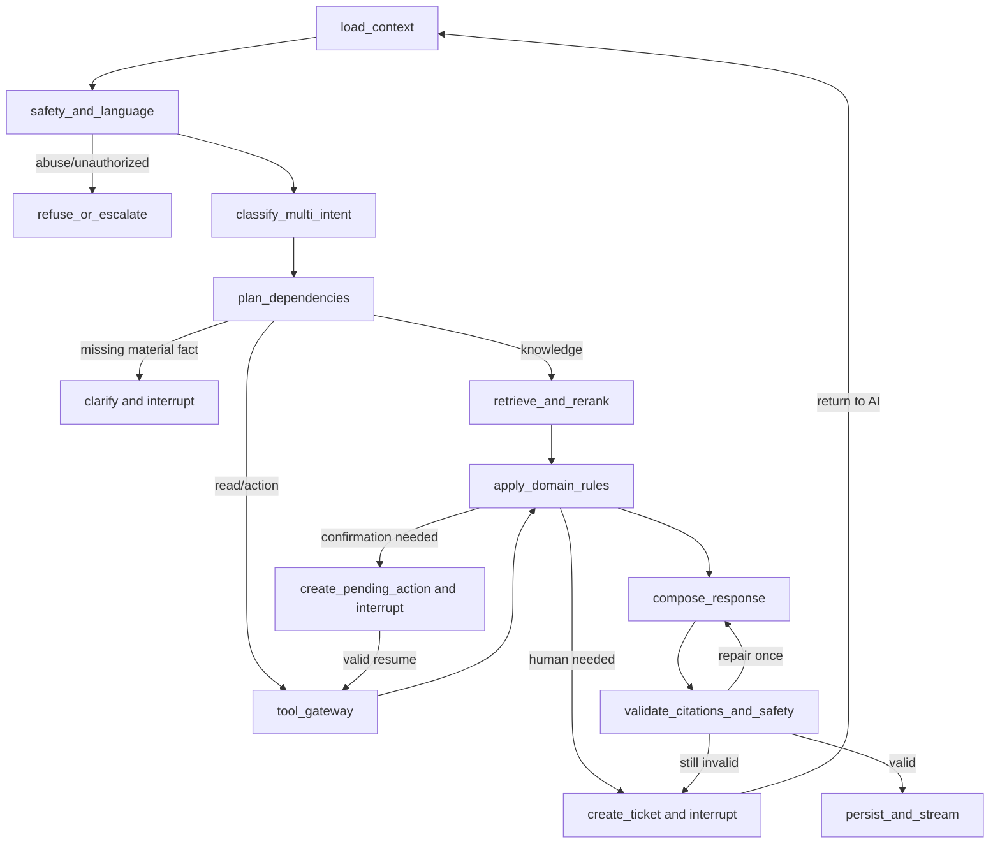

# Agent Workflows and Tools

## Typed graph state

`AgentStateV1` is schema-versioned and contains only useful operational data:

| Field | Type / purpose |
|---|---|
| `schema_version`, `run_id`, `correlation_id` | Version and trace identifiers. |
| `organization_id`, `conversation_id`, `checkpoint_version` | Durable tenant/thread identity and optimistic concurrency. |
| `actor` | Trusted `anonymous | customer(customer_id) | staff(staff_id, role)` from FastAPI, never model input. |
| `locale` | `en | fr`, confidence, and fallback disclosure flag. |
| `messages` | User-visible messages and safe staff notes; bounded window plus durable summary. |
| `intents` | List of `{label, confidence, status, dependencies}`; labels include `knowledge`, `order`, `tracking`, `return`, `address_change`, `refund`, `sales_lead`, `human_help`, `other`. |
| `active_intent_ids`, `clarification` | Execution focus and one targeted missing/ambiguous-field request. |
| `auth_context` | Authentication assurance and authorized customer scope; no credentials. |
| `risk` | Per-intent `public_read | authenticated_read | guarded_write | human_only`. |
| `retrieval` | Query, locale, approved chunk references, scores, policy/document versions. |
| `tool_budget`, `tool_runs` | Remaining steps and structured requests/result references/errors. |
| `facts` | Normalized, provenance-tagged order/customer/tracking/return facts and freshness. |
| `pending_action` | ID, type, canonical preview hash, expiry, required confirmer, status; never raw confirmation secret. |
| `refund_decision` | `eligible | ineligible | manual_review`, reason codes, facts hash, policy version. |
| `consent` | Purpose, affirmative evidence message ID, timestamp and scope. |
| `handoff` | Ticket ID, reason, factual summary reference, ownership/status. |
| `failures` | Typed failures, retry counts and safe customer disclosures. |
| `response` | Draft, citation IDs, validator status, final visible answer. |

Messages, tool requests/results, citations, decisions, summaries, interrupts and audit references persist. Hidden reasoning and provider credentials/payloads do not.

## Nodes and routes

Independent public/read intents may execute in parallel, but results are composed in the user's order. Dependencies (policy + order before refund decision) execute topologically. Guarded writes are serialized and each gets a separate explicit confirmation; confirmation of one never implies another.

Clarify when ownership/authentication is absent for private data, an order is ambiguous, required address/lead data is incomplete, pronouns conflict across multiple orders, consent is not explicit, the requested action or consequences are unclear, or two intents prescribe conflicting writes. Do not ask for data already available from a trusted source.

Automatically escalate on customer request; credible safety/legal threat; suspected account takeover or repeated ownership failures; policy/evidence conflict; refund `manual_review`; any real-provider refund action; address update after fulfillment lock or provider ambiguity; repeated provider failure after bounded retry; failed citation validation after one repair; unsupported high-impact action; abusive loop that needs moderation; or tool/time budget exhaustion where the issue is time-sensitive.

## Workflow specifications

1. **Policy/product question:** detect language → hybrid search approved tenant corpus → local rerank → draft only from evidence → validate citation/version → answer or disclose insufficient evidence/escalate.
2. **Order/tracking:** require customer session → inject customer scope → fetch order, then tracking if applicable → return only owned normalized fields with freshness; `not_found` and forbidden share the same customer-visible response.
3. **Address change:** authenticate → fetch owned order → collect/validate address → provider preview and eligibility → show canonical before/after and consequences → create expiring pending action → interrupt → explicit confirmation → atomically consume token, re-fetch/revalidate → execute with idempotency key → audit/result. Changed facts require a new preview.
4. **Refund:** authenticate → retrieve effective policy → fetch owned order/return facts → deterministic service decides → explain with citation. `ineligible` offers human review; `manual_review` creates ticket; `eligible` creates an idempotent refund request after explicit confirmation. Shopify-backed requests always stop for human approval and never autonomously transfer money.
5. **Sales lead:** detect buying/business interest → explain CRM purpose and fields → ask opt-in → only an unambiguous affirmative reply records consent → upsert minimum fields → disclose outcome. A product question is not consent.
6. **Human handoff:** compile extractive/structured summary from visible messages and verified facts → create ticket → append audit → `interrupt()` AI → notify queue. Summary separates customer claims from verified facts and contains no inferred sentiment/diagnosis.
7. **Staff lifecycle:** RBAC take over → staff owns stream and replies → resolve or return to AI with note. Returning invalidates stale pending actions, refreshes trusted context and resumes routing. All ownership transitions/replies are audited.
8. **Mixed request:** classify all labels → map dependencies and risk → answer safe portions, request authentication/clarification where needed, and present at most one write confirmation at a time. Partial failure does not erase successful independent results.
9. **Provider failure:** typed timeout/rate-limit/unavailable → safe bounded retry/circuit breaker → mark freshness/unavailable fields → never substitute model knowledge → preserve state and offer retry or ticket.
10. **Webhook update:** verify and persist inbox → async normalize/deduplicate → update projection → append event/notify thread → invalidate conflicting previews and resume only workflows explicitly waiting for that event.
11. **EN/FR:** detect per turn, preserve identifiers verbatim, retrieve matching locale, respond in customer language. If only another approved language exists, say that a translated explanation is being supplied and retain citation to source.
12. **Injection/unauthorized access:** isolate untrusted instructions, never pass identity from prompt into tools, deny cross-customer/tenant references, give no existence oracle, record reason code, and escalate repeated suspicious attempts.

## Deterministic refund eligibility

`RefundEligibilityService.evaluate(order_snapshot, return_snapshot, policy_ruleset)` is pure, versioned, and independently tested. It returns `{decision, reason_codes[], policy_version, evaluated_at, facts_hash}`. RAG provides explanatory passages only.

Initial synthetic NovaCart rules (configuration version `refund-v1`):

- `eligible`: payment is captured; refundable amount is positive; delivery was no more than 30 calendar days ago; item category is not final-sale; no chargeback/open refund exists; required return state is satisfied.
- `ineligible`: a definitive rule fails, with codes such as `WINDOW_EXPIRED`, `FINAL_SALE`, `NOT_PAID`, `NO_REFUNDABLE_AMOUNT`, `ALREADY_REFUNDED`.
- `manual_review`: facts are missing/stale/conflicting, delivery timestamp is uncertain, item damage/fraud/warranty judgment is required, policy version is unavailable, amount exceeds configured threshold, or provider state cannot be reconciled. Codes include `MISSING_FACTS`, `POLICY_CONFLICT`, `DAMAGE_REVIEW`, `HIGH_VALUE`, `PROVIDER_UNAVAILABLE`.

The decision and exact effective policy version are stored on the request. All real-provider refunds require human approval even when `eligible`; the initial system creates a request only.

## Tool catalog

All inputs/outputs use strict JSON schemas (`additionalProperties: false`), enums, lengths and formats. Trusted `organization_id`, actor/customer identity, locale, correlation ID and provider selection are gateway-injected and are therefore omitted from model-proposed inputs. Every invocation creates a `ToolRun`; sensitive fields are encrypted or redacted.

### Read tools

| Tool | Purpose | Identity | Inputs | Output | Errors | Risk / confirmation | Audit and idempotency |
|---|---|---|---|---|---|---|---|
| `search_knowledge_base` | Find approved policy/product evidence | Anonymous for public corpus; actor + tenant always scoped | `query`, `locale`, `doc_types?`, `limit<=10` | Ranked chunk refs, excerpts, document/version/effective metadata | `validation`, `no_evidence`, `unavailable` | `public_read`; none | Log query hash, filters, chunk IDs/version and validator result; reads need no idempotency key. |
| `get_authenticated_customer` | Load minimal current customer profile | Authenticated customer, or staff with `support_read` and ticket context | `fields[]` allowlist | Normalized customer/profile freshness | `unauthenticated`, `not_found`, `unavailable` | `authenticated_read`; none | Audit actor, subject, fields, outcome; no key. |
| `get_order_status` | Resolve a customer-facing order number and return safe live status/tracking facts | Authenticated customer owner; tenant and customer are server-injected | `order_number` (normalized public number only) | Status, fulfillment, carrier, tracking, events, ETA and UTC retrieval time | `invalid_order_number`, `order_not_found`, `ambiguous_order_number`, `provider_timeout`, `provider_unavailable` | `authenticated_read`; none | Scope every lookup to tenant/customer; do not expose internal provider IDs; no key. |
| `get_order` | Fetch authoritative owned order | Customer owner; staff with scoped permission/reason | `order_ref` | Normalized order, line items, amounts/status/version/freshness | `not_found`, `conflict`, `timeout`, `unavailable` | `authenticated_read`; none | Audit actor/subject/order ref/outcome, not full address; no key. |
| `get_tracking` | Get shipments and carrier tracking state | Same verified ownership/staff scope as order | `order_ref`, `shipment_ref?` | Carrier, safe tracking URL, status/events/ETA/freshness | `not_found`, `unsupported`, `timeout`, `unavailable` | `authenticated_read`; none | Audit refs/outcome; no key. |
| `get_return_status` | Get return/refund lifecycle facts | Same verified ownership/staff scope as order | `order_ref`, `return_ref?` | Return state, received items, refund-request state/freshness | `not_found`, `unsupported`, `timeout`, `unavailable` | `authenticated_read`; none | Audit refs/outcome; no key. |

### Guarded write tools

| Tool | Purpose | Identity | Inputs | Output | Errors | Risk / confirmation | Audit and idempotency |
|---|---|---|---|---|---|---|---|
| `propose_shipping_address_change` | Validate capability and generate non-mutating canonical preview | Authenticated owning customer; scoped staff | `order_ref`, structured `new_address` | Pending action ID, masked before/after, warnings, action hash, expiry | `not_found`, `validation`, `locked`, `unsupported`, `conflict`, `unavailable` | `guarded_write` proposal; no confirmation to preview | Audit proposal and field-level diff (sensitive values encrypted); client request ID deduplicates equivalent proposals. |
| `execute_confirmed_address_change` | Apply exactly the confirmed preview after fresh checks | Same actor/session as pending action, or authorized approving staff | `pending_action_id`, `confirmation_token` | New address version/status/provider ref | `invalid_confirmation`, `expired`, `replayed`, `stale`, `locked`, `conflict`, `unavailable` | `guarded_write`; **explicit confirmation required** | Audit validation, consumption and outcome; required stable idempotency key derived from pending action; reconcile unknown outcomes before retry. |
| `create_refund_request` | Create case/request from deterministic decision; no autonomous real money | Owning customer or staff; human approver for real provider | `order_ref`, `decision_ref`, `amount?`, `reason_code`, `confirmation_token` | Refund request/ticket ID and status (`requested|awaiting_approval`) | `ineligible`, `stale_decision`, `invalid_confirmation`, `duplicate`, `conflict`, `unavailable` | `guarded_write`/`human_only` for Shopify; customer confirmation and real-provider human approval required | Audit facts/policy/decision/amount/approver; key binds order + decision + amount + action. |
| `upsert_sales_lead` | Create/update a CRM contact for stated sales purpose | Customer/visitor with verified contact channel as configured and explicit consent evidence; authorized staff may record sourced consent | Minimal `email`, `first_name?`, `last_name?`, `interest`, `consent_message_id` | Normalized contact ref, `created|updated`, consent timestamp | `consent_missing`, `validation`, `conflict`, `rate_limited`, `unavailable` | `guarded_write`; **explicit purpose-specific consent required** (the affirmative response is confirmation) | Audit consent evidence/purpose and changed fields; key uses tenant + normalized email + consent purpose/version. |
| `create_support_ticket` | Open/escalate human work with factual summary | Any conversation actor; system for auto-escalation | `conversation_id`, `reason_code`, `priority`, structured `summary_ref`, `related_refs[]` | Ticket ID, queue, status | `validation`, `duplicate`, `unavailable` | Low external write but control-impacting; customer confirmation not required when requested or safety/rules demand escalation | Audit trigger, summary provenance, queue and ownership; key uses conversation + escalation episode/reason. |

## Confirmation and interruption protocol

A pending action stores canonical parameters, preview/facts versions, actor and conversation binding, policy version if relevant, creation/expiry (default 10 minutes), status, and hash. The server issues a high-entropy signed token containing only opaque references. Confirmation must be a dedicated UI action or an unambiguous reply after the preview; generic “yes” is rejected when multiple actions exist. Consumption uses a database transaction/unique constraint before provider execution. Rejection, expiry, newer conflicting messages, webhook changes, logout, staff takeover, or changed provider version invalidates it.

On interruption the checkpoint ID and reason are durable. Resume endpoints authenticate again and use optimistic locking. After restarts or long waits, the graph reloads facts; it does not replay completed tools. Unknown provider write outcomes enter reconciliation/manual review. Maximum limits and timeouts are defined in `ARCHITECTURE.md` and apply equally in both languages and provider modes.
