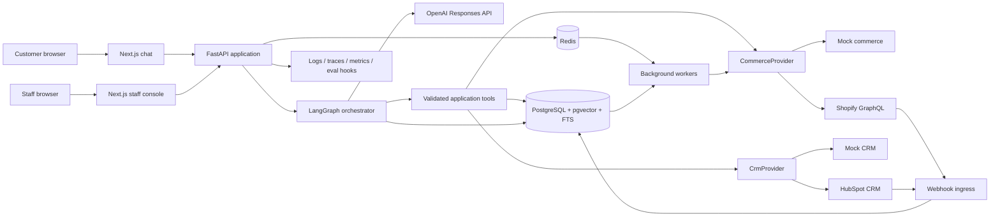
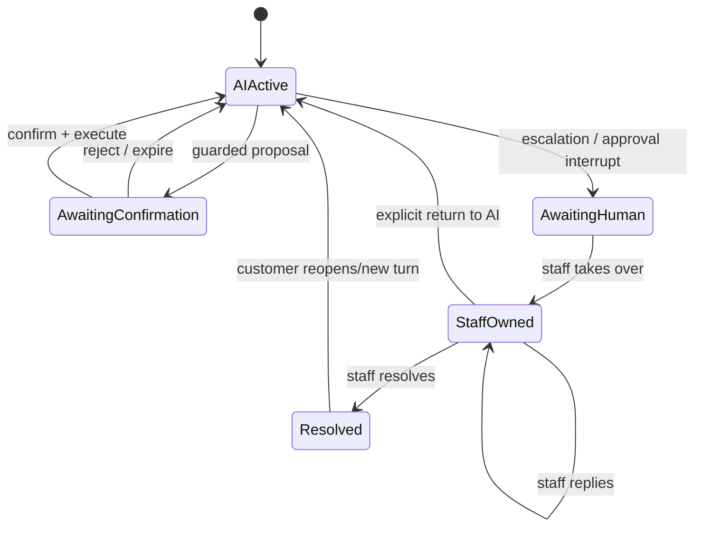

# Architecture

## Context and components

Next.js is a presentation/BFF client, never a trust boundary. FastAPI authenticates sessions, authorizes staff roles, loads organization context, validates request schemas, invokes/resumes the graph, exposes streaming updates, and ingests webhooks. LangGraph uses typed state and a PostgreSQL checkpointer keyed by organization and conversation. The OpenAI Responses API receives minimal state and strict tool schemas; it cannot directly access databases or providers.

## Provider boundary

Application-owned `CommerceProviderV1` and `CrmProviderV1` contracts accept an explicit `ProviderContext(organization_id, actor, correlation_id, idempotency_key)` and normalized commands/queries. They return domain objects or a typed error: `not_found`, `not_authorized` (internally indistinguishable to customers), `conflict`, `validation`, `unsupported`, `rate_limited`, `timeout`, or `unavailable`.

Normalized models include opaque `external_ref`, ISO-4217 decimal money, ISO-8601 UTC timestamps, canonical address fields, explicit nullable fields, and mapped lifecycle enums while retaining a non-sensitive `provider_status` for diagnostics. Adapter payloads never enter prompts unfiltered. Feature capability checks happen before proposals. Mock and real adapters pass the same contract suite.

## Request lifecycle and trust boundaries

1. Edge/session layer authenticates when required and issues organization/customer/staff claims. Anonymous access is limited to public knowledge.
2. FastAPI creates a correlation ID, rate-limits, validates input, and appends the customer message.
3. LangGraph restores typed state, classifies multi-label intent/risk, retrieves evidence, and proposes tools.
4. The tool gateway ignores model-supplied identity: it injects trusted identity, checks authorization/ownership/rules, validates strict schemas, records a tool run and audit event, then calls the adapter.
5. Guarded writes create a `PendingAction`; execution requires a fresh signed single-use confirmation bound to actor, conversation, action hash, expiry, and version. Provider state is re-read before execution.
6. Results are normalized and minimized before re-entering the graph. Citation validation and output policy run before streaming.
7. Checkpoints and useful structured state persist. Reasoning tokens/private chain-of-thought do not.

## Retrieval and citations

Ingestion parses only approved sources, records document/version/language/effective dates and checksum, chunks them, embeds them in pgvector, and builds PostgreSQL full-text indexes. At query time tenant/language/status filters precede hybrid vector + lexical retrieval. Reciprocal-rank fusion produces candidates; a pinned local reranker reorders them. The answer can cite only returned chunk IDs. A deterministic validator confirms document approval, current/effective version, tenant, quoted/attributed claim support, and citation presence. Failure yields a limited “I could not verify that” answer or escalation, not uncited policy.

Documents and provider text are untrusted content: delimiters, instruction-stripping classification, metadata filters, and tool isolation prevent them from altering system behavior. RAG explains refund policy; `RefundEligibilityService` alone decides eligibility.

## Durable orchestration and handoff

LangGraph `interrupt()` persists the checkpoint and an explicit resume reason for customer confirmation or human work. While staff-owned, new customer messages append and notify staff but do not trigger AI replies. Staff return-to-AI writes a handoff note, refreshes authentication/provider facts, and resumes from a safe routing node—not the interrupted model call. Duplicate resume requests are idempotent. A newer message may invalidate a pending proposal; only one guarded write executes at a time.

## Webhooks and jobs

Webhook ingress reads raw bytes, resolves provider/tenant by endpoint key, verifies signature and timestamp before parsing, rate-limits, and inserts a unique inbox record (`provider`, `organization_id`, `external_event_id` or payload hash). It acknowledges after durable insert. Redis queues the database event ID; workers claim it, normalize, update local order projections conditionally by provider version/time, append audit events, notify clients, and retry with exponential backoff. Poison events go to a dead-letter state with alerts. PostgreSQL is the durable job truth; Redis delivery may be repeated.

## Reliability limits

Default per-turn budget: at most 8 tool executions, 2 guarded-write proposals, and 25 seconds of active orchestration (pauses excluded). Provider reads time out at 5 seconds and writes at 10 seconds; OpenAI calls at 15 seconds. Retry at most twice for retryable reads with jitter within the budget; never blindly retry a write without the same idempotency key and reconciliation. Circuit breakers and typed degraded responses prevent cascades. Budget exhaustion produces a partial factual answer plus retry/escalation choice.

## Observability and deployment boundaries

Structured JSON logs, OpenTelemetry traces and metrics carry pseudonymous IDs and outcome/reason codes, never raw prompts, secrets, tokens, full addresses, email, or provider payloads. Metrics cover latency, tool/error/escalation rates, retrieval/citation quality, confirmation outcomes, queue lag, webhook duplicates, and policy decisions. Evaluation hooks store dataset/scenario IDs and structured outputs for offline scoring with redacted samples.

Separate web, API and worker processes use least-privilege service identities. Provider secrets come from a secret manager/environment injection, are never exposed to browsers/models/logs, and are independently scoped/rotated. Production-like environments use TLS, encrypted storage/backups and network egress allowlists.
