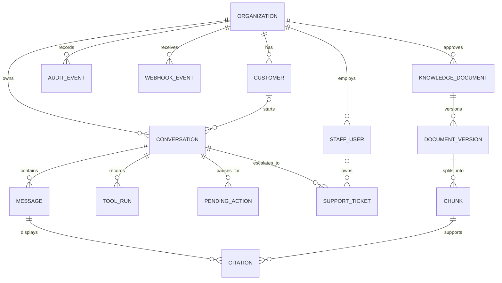

# Data Model

## Principles

UUIDs are internal; provider identifiers are opaque and unique only within `(organization_id, provider, resource_type)`. Tenant-owned tables carry `organization_id`, timestamps and optimistic versions. Foreign keys, repository scoping and (where practical) PostgreSQL row-level security provide defense in depth. Sensitive fields are minimized/encrypted; audit records are append-only. Deletion/retention workflows tombstone references where legal preservation is required.

## Entities

| Entity | Key fields and invariants |
|---|---|
| `Organization` | `id`, slug, status, default locale/timezone, provider configuration references, retention/policy settings. Secrets are not stored here. |
| `Customer` | `id`, `organization_id`, encrypted/minimized profile, locale, auth subject, normalized provider links. Unique auth subject per tenant; external refs never authenticate. |
| `StaffUser` | `id`, `organization_id`, auth subject, status; many-to-many roles (`support_agent`, `support_manager`, `sales`, `admin`, `auditor`) with least-privilege permissions. |
| `Conversation` | `id`, tenant, optional customer, channel/locale, ownership `ai|staff`, assigned staff, status, latest checkpoint, summary ref/version. Ownership transitions are controlled/audited. |
| `Message` | `id`, tenant/conversation, immutable sender type/ref, locale, visible content or encrypted reference, timestamp, reply-to, delivery status. Staff notes are explicitly non-customer-visible. |
| `ToolRun` | `id`, tenant/conversation/run, tool/schema version, actor, sanitized request/result refs, risk, timestamps, outcome/error, idempotency key hash, provider correlation. No hidden reasoning. |
| `PendingAction` | `id`, tenant/conversation/customer, type, canonical payload encrypted, preview/facts hash, provider version, expiry, status, confirmer binding, token hash, consumption/result refs. State transitions are compare-and-set. |
| `SupportTicket` | `id`, tenant/conversation, reason/priority/queue/status, structured summary/provenance, assignee, approval fields, resolution and SLA timestamps. |
| `AuditEvent` | `id`, tenant, occurred/recorded times, actor, action, target refs, outcome/reason, correlation, safe metadata, previous-event hash/event hash. Insert-only application role and retention lock. |
| `WebhookEvent` | `id`, tenant/provider, external event ID/payload hash, signature status, encrypted/raw reference with short retention, received time, processing state/attempts/error, normalized resource/version. Unique dedupe key. |
| `KnowledgeDocument` | `id`, tenant, stable slug/type, audience, owner, status. Only `approved` documents are retrievable. |
| `DocumentVersion` | `id`, document, semantic/version label, locale, effective interval, checksum, source/provenance, approval identity/time, ingestion status. No overlapping active policy version per scope. |
| `Chunk` | `id`, document version, ordinal, text, token count, embedding, full-text vector, metadata/page/section anchor, checksum. Embedding model/version recorded. |
| `Citation` | `id`, tenant, message, chunk, claim/character anchor, displayed label/link, validator result/version. Cannot cite an unapproved or cross-tenant chunk. |

Supporting records include `ProviderLink`, `OrderProjection`, `ConsentRecord`, `RefundDecision`, `Job/DLQ`, `Role/Permission`, and LangGraph checkpoint tables. `ConsentRecord` binds purpose/version to evidence; `RefundDecision` stores reason codes, facts hash and policy version.

## Relationships and lifecycle constraints

- A customer may have many conversations and provider links. Anonymous conversations become customer-bound only after authenticated linking, never by email matching alone.
- Messages and tool runs are append-oriented. Corrections create new records; displayed redaction preserves an audit reference.
- A conversation has many pending actions, but at most one executable guarded action at a time. Terminal actions cannot return to pending.
- A ticket may span one conversation and reference multiple verified resources; only authorized staff can own it.
- Each answer citation joins a visible message to the exact immutable chunk/version used.
- Checkpoint state references entities rather than duplicating secrets or large provider payloads.

## Sources of truth and caching

Shopify or the selected mock commerce service is authoritative for customers' commerce order, fulfillment, shipment, address mutability, payment and return facts. HubSpot or mock CRM is authoritative for CRM contact identity after a successful upsert. PostgreSQL is authoritative for NovaCart conversations, messages, consent evidence, pending actions, refund decisions/requests, support tickets, tool/audit history, webhooks, knowledge/version approval and graph checkpoints.

`OrderProjection` may cache normalized order/fulfillment/tracking fields, external refs, provider version/ETag, `observed_at` and `expires_at` for display and webhook correlation. Default read TTL is 60 seconds and is configurable. Security/ownership, address execution, refund eligibility and confirmations require a live provider read or a freshness-qualified signed webhook projection; stale cache is labeled and never authorizes a write. Cache invalidation is provider-version-aware so older webhooks cannot overwrite newer facts.

## Retention assumptions

Durations are configuration pending legal review: proposed 30 days for raw webhook bodies, 90 days for detailed operational logs, 24 months for support conversations/tool runs, and 7 years for minimal financial-approval/audit records where applicable. Knowledge versions and citations remain while referenced. Data-subject deletion removes or pseudonymizes customer content while retaining legally required minimal, non-content audit proof.
