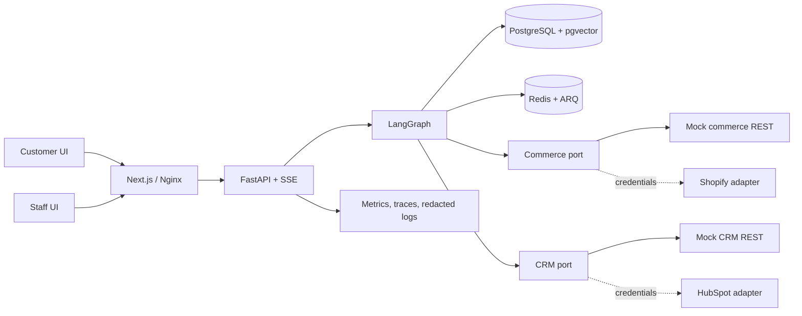
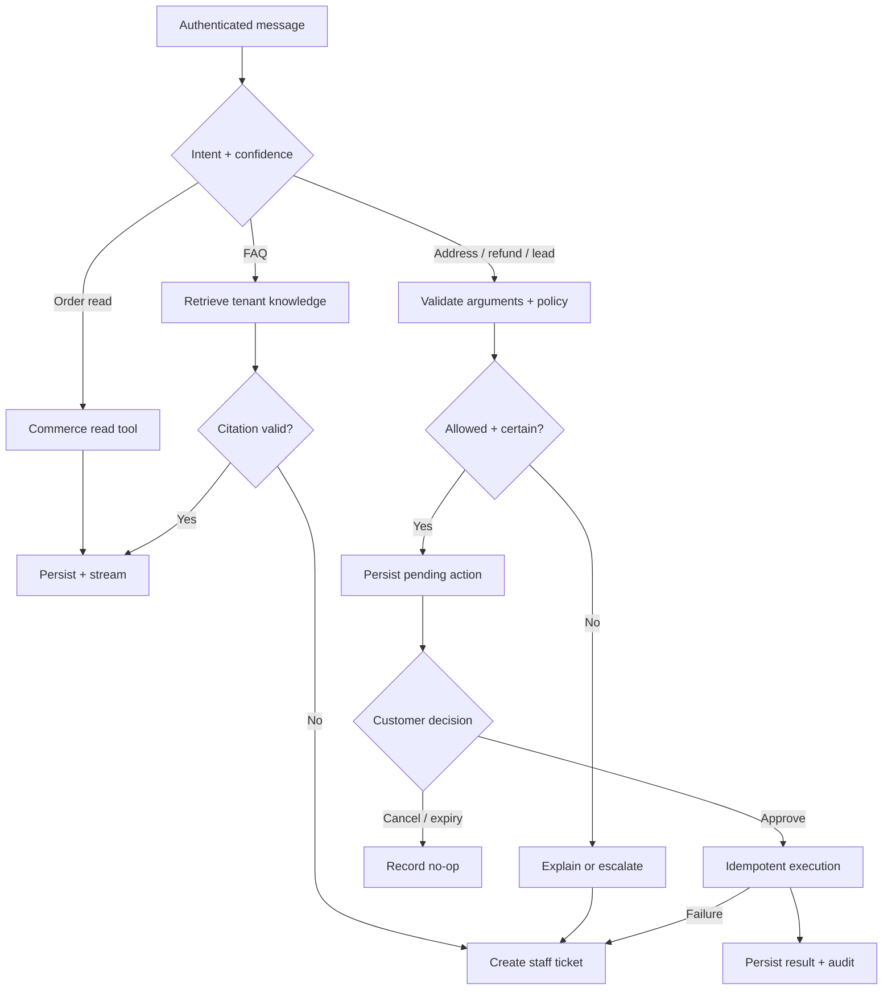

# NovaCart AI support case study

## Business problem and roles

Support teams repeatedly answer policies, look up orders, and copy customer details between systems. Blind automation is risky: an unsupported answer harms trust, while an accidental address change, refund, or CRM contact has consequences. NovaCart demonstrates controlled automation for customers seeking self-service and staff taking ownership when automation should stop.

## System architecture

The UI never contacts providers directly. FastAPI establishes identity and tenant scope; LangGraph owns routing/checkpoints; adapters isolate vendor contracts; PostgreSQL persists state, knowledge, actions, and audit; Redis supports work and bounded execution.

## Agent routing and safety

This describes controls, not hidden chain-of-thought.

## Design decisions

Policies live in versioned, tenant-scoped RAG because prose needs citation and controlled updates. Orders, refunds, and contacts come from provider APIs because they are mutable operational facts. Reads execute directly; consequential writes persist a structured pending action and suspend the graph. Approval resumes with an expiring signed token and idempotency key, so retries reuse an outcome rather than duplicate a side effect.

Low confidence, missing data, provider failure, or an explicit request creates a tenant-scoped ticket. Staff can claim, publicly reply, privately note, resolve, or return it to AI; audit history preserves transitions. Organization scope reaches sessions, RLS queries, provider bindings, knowledge, tools, tickets, and analytics. The runtime database role is tested as non-owner/non-superuser, while production-like Compose adds TLS, headers, network isolation, and mounted-secret support.

## Evidence, tradeoffs, and limitations

Deterministic evaluations cover grounding, routing, confirmations, failures, multilingual behavior, and adversarial inputs. Metrics cover HTTP, agent, tools/providers, queues, budgets, and SSE. The M15 local baseline completed 102 mixed workflows at concurrency 1/4/8 with zero workflow errors; at concurrency 8 it measured 0.754 workflows/s, HTTP P50/P95 2062/2872 ms, and agent-run P50/P95 2501/2896 ms. These are documented local Docker results, not a production SLA.

Deterministic mode is repeatable but does not demonstrate generative quality. OpenAI mode is optional and variable. Mock REST services exercise persistence, auth, failures, and contracts, but not every vendor edge case. Demo authentication is synthetic. No cloud deployment, live Shopify/HubSpot verification, or production traffic is claimed.

To replace mocks, independently select `shopify` and/or `hubspot`, supply secrets through the documented mechanism, and retain the same application-facing ports. A client launch must still validate scopes, webhooks, rate limits, tenant mapping, retention, and rollback in its own sandbox accounts.
